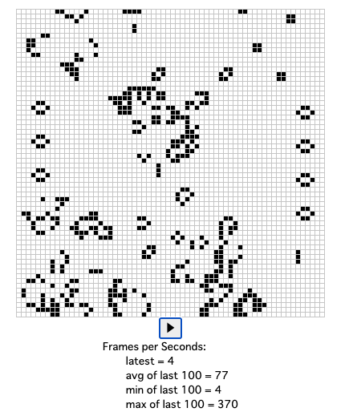
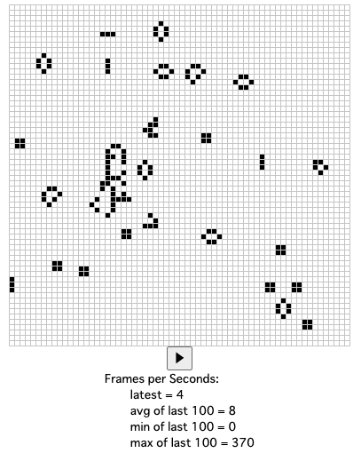

### アプリ

- [こちら](https://rust-wasm-lifegame.web.app/)

 

### 環境

- Rust 1.65.0
- wasm-pack 0.10.3
- cargo-generate 0.17.3
- node 16.15.1
- npm 8.11.0
- nvm 0.39.2
- firebase-tools 11.17.0

### メモ

- 4.5 のテストは 下記で行った
  wasm-pack test --chrome --headless

- 4.7

  - index.js の

```rust
const playPauseButton = document.getElementById("play-pause");
```

の下に

```rust
playPauseButton.textContent = "⏸";
```

を追加して初期画面にボタンが表示されるようにした

- 4.8 に
  - index.html と同じフォルダに index.css を追加
  - index.html の <header> に、下記を追加

```css
<link rel="stylesheet" type="text/css" href="index.css">
```

### 構成ファイル

- 更新したファイルのみアップロードしている

### 参考サイト

- [Rust + WebAssembly のチュートリアル](https://rustwasm.github.io/docs/book/introduction.html)
- [Error: error:0308010C:digital envelope routines::unsupported 対策](https://zenn.dev/pontagon333/articles/26c89cbc14e81f)
- [JavaScript のレンダリングにスリープ処理を入れる](https://www.wakuwakubank.com/posts/695-javascript-timer-sleep/)
- [Firebase へのデプロイ](https://qiita.com/namn1125/items/8ffa0f87fa03f59f3acc#4-firebase%E3%81%A7%E3%83%87%E3%83%97%E3%83%AD%E3%82%A4)
- [nvm で node のバージョン切り替え](https://maku77.github.io/nodejs/env/nvm)
